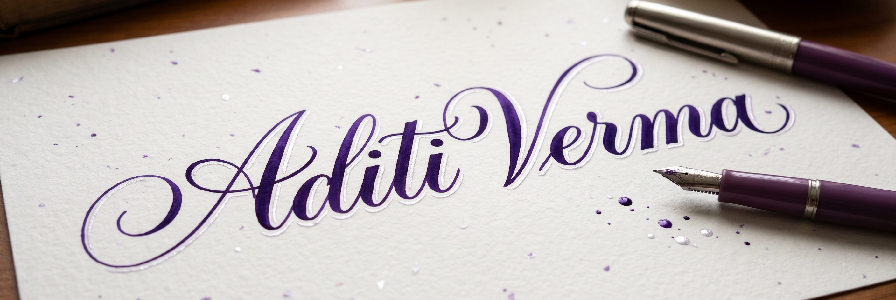

# 

  
  
   
  
  

---

### 👋 Hey there! I’m Aditi Verma

* 🌱 Currently diving into **DSA** & mastering **Full-Stack Development**
* 👀 Passionate about **Backend Architecture** and **scalable applications**
* 💞️ Open to collaborating on full-stack web and mobile apps
* 📫 Reach me at: 
  

😄 Pronouns: **She/Her** ⚡ Fun fact: I write clean, efficient solutions with a sharp eye on time and space complexity! 

---

### 🛠 Tech Stack

**Frontend:**  
 
 
 

**Backend:**  
 
 

**Database:**  
 

**Languages:**  
 

**Tools:**  
 

---

### 🌐 Connect With Me

 

---

### 📊 GitHub Stats

